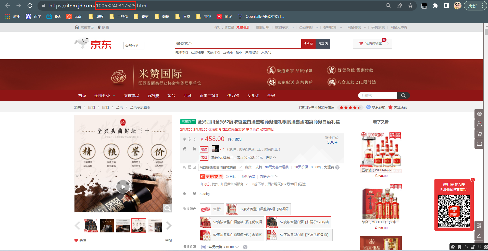

## 京东商品评论爬虫-python ##

本项目来源于[《腾讯云 Cloud Studio 实战训练营》](https://marketing.csdn.net/p/06a21ca7f4a1843512fa8f8c40a16635)的参赛作品，该作品在腾讯云 [Cloud Studio](https://www.cloudstudio.net/?utm=csdn) 中运行无误。

##  使用步骤 ##

1.找到你要爬取商品的ID，就是商品的详情页网址里的那一串数字ID

2.运行JD_comment_spider.py文件，然后需要你输入要爬取的商品ID和爬取的页数（不能超过商品的最大评论页数）

3.程序运行完成后，评论内容在同目录下的JD_comment_ID.txt中查看

注：程序可能会随着时间的推移而过期，比如京东网页结构发生变化就需要重新编写代码，还有就是cookie过期，这时需要替换成你登录京东网站后的cookie。如遇解决不了的问题，可以联系我。
